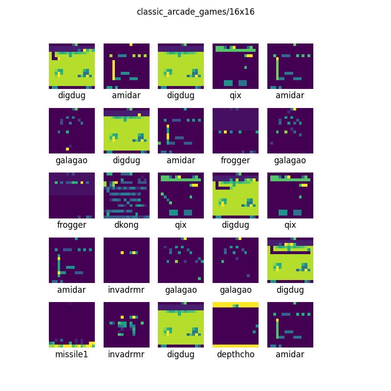
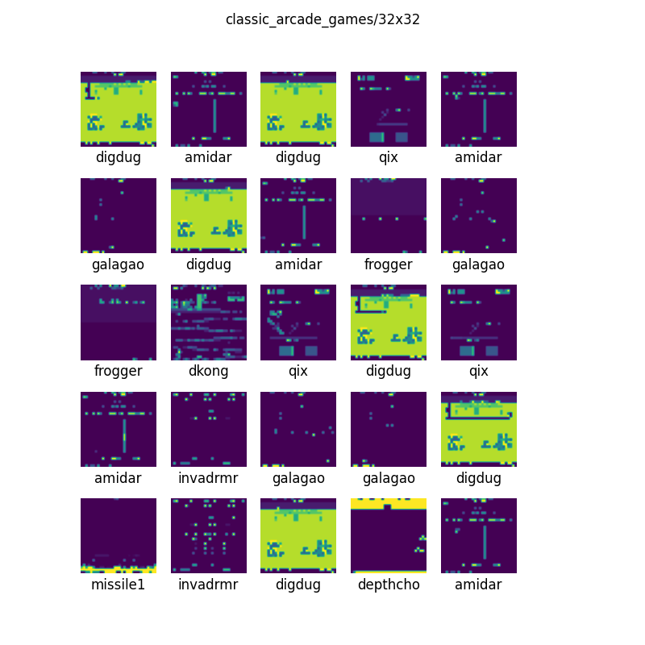
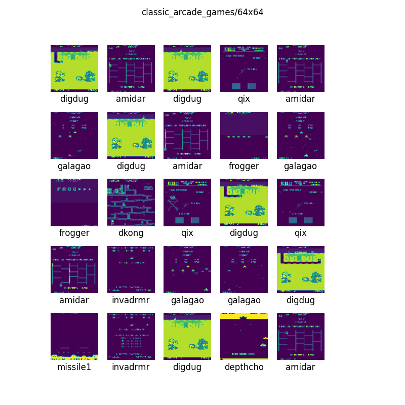
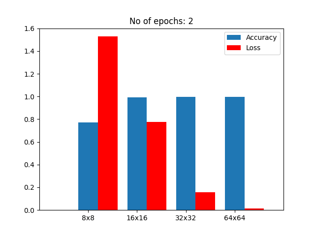
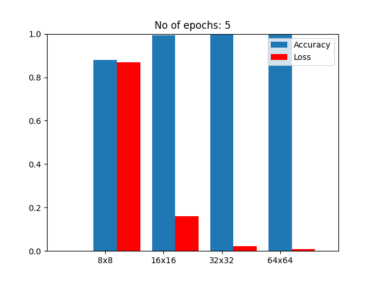
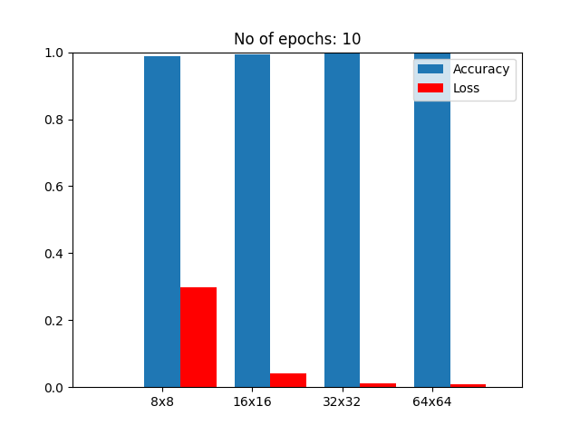

# classic-arcade-game-dataset
A TensorFlow dataset for identifying classic arcade games from sequenzes of screendumps.
All screendumps for a game are, typically, from the games attract mode.
The sequence could also be from the game being played, if the game only has a single stage/level.
That is, what is trying to recognize, are 

The games are identified using the name of the game's MAME ROM set.

The dataset is available as archive files or as a [TensorFlow dataset](https://www.tensorflow.org/datasets)
built with the [TFDS CLI](https://www.tensorflow.org/datasets/cli).

last part of sequence is used for testing, and first par for training.
Not good. Should be mixed.

# Supported games

The dataset contains data for the following games (As named in MAME):
* amidar
* depthcho
* digdug
* dkong
* frogger
* galagao
* invadrmr
* missile1
* pacman
* qix
* rallyx

# How to use
An example of loading the _16x16_ version of the [TensorFlow dataset](https://www.tensorflow.org/datasets). The first 50% will
be used for training, and the second 50% will be used for testing:
```python
import tensorflow_datasets as tfds

from dataset import classic_arcade_games

(train_images, train_labels), (test_images, test_labels) = tfds.load(
    "classic_arcade_games/16x16",
    split=['train[:50%]', 'train[50%:]'],
    as_supervised=True,
    batch_size=-1
    )
```

For a full example, take a look at _dataset_demo.py_ in this repository,
as well as [this Terraform tutorial](https://www.tensorflow.org/tutorials/keras/classification).

# Data
The data in this dataset has been collected by running MAME and manually
creating screendumps from the chosen sequenze in the game.

## Raw data
Unmodified screendumps are stored in _/data/mame/original/<mame_id>/*.png_

## Modified data
Squared, grayscale version in different resolutions, are avaiable in _.zip_ archives.
These images have been created using the script _scale_screndumps.py_.
are stored in these directories:

* _data/mame/8x8.zip_
* _data/mame/16x16.zip_
* _data/mame/32x32.zip_
* _data/mame/64x64.zip_

# Contributing
Please contribute to this dataset by adding screendumps made with MAME of game sequences.
Make a [PR](https://docs.github.com/en/pull-requests/collaborating-with-pull-requests/proposing-changes-to-your-work-with-pull-requests/about-pull-requests) adding around 100 screendums to _data/original/\<name-of-game-rom\>/\<number\>.png_.
Do not use any effects on the image.

# Illustrations
Examples of what the squared screendumps look like.






# Performance
Results for the variations of the dataset with 50% of the data used for training and the other 50% used for testing. 





